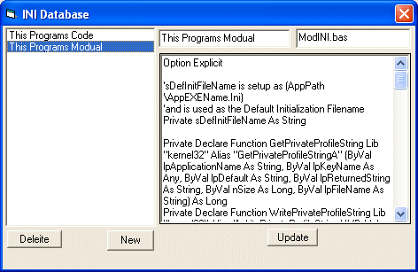



## INI Code Database

### Description

Who says you cant store code in a INI file ! The workarounds where quite easy ! Name says it all. Enjoy !!!
 
### More Info
 

             |
---                |---
**Submitted On**   |2006-07-09 07:05:40
**By**             |[Thomas Swift](https://github.com/Planet-Source-Code/PSCIndex/blob/master/ByAuthor/thomas-swift.md)
**Level**          |Intermediate
**User Rating**    |5.0 (10 globes from 2 users)
**Compatibility**  |VB 6\.0
**Category**       |[String Manipulation](https://github.com/Planet-Source-Code/PSCIndex/blob/master/ByCategory/string-manipulation__1-5.md)
**World**          |[Visual Basic](https://github.com/Planet-Source-Code/PSCIndex/blob/master/ByWorld/visual-basic.md)
**Archive File**   |[INI\_Code\_D200531792006\.zip](https://github.com/Planet-Source-Code/thomas-swift-ini-code-database__1-65905/archive/master.zip)

